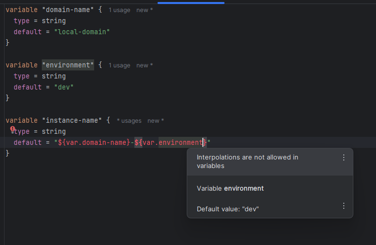

# Terraform-Practise 

## Providers 
- AWS
- Azure
- GitHub
- etc.,. can connect to many tools

- AWS Provider developed by both AWS and Terraform

## Commands
- `terraform init` -> Download the provider
- `terraform plan` -> Plan the infrastructure, but it will not create
- `terraform apply` -> Create the infrastructure
- `terraform destroy` -> Destroy the infrastructure

## Variables Types
- string
- number
- map
- list
- set
- bool

### Variables can be passed through
```text
1. Default variables ex: variables.tf
2. Terraform variables ex: terraform.tfvars
3. Command Line       ex: terraform plan -var="sg_name=allow-all-terraform-cmd"
4. Environment Variables  ex: export TF_VAR_<NAME>=<VALUE>
```

### Precedent goes through
```text
1. Command Line
2. Terraform tf vars
3. Environment variables
4. Default Variables
```

## Condition
- Conditional Expression  -> ex: `var.environment == "dev" ? "t3.micro"" : "t3.small"`


## Loops
- Count Based Loops
- For_Each Loops   (Can only apply through Map or Set. ForEach cannot be applied through list)
- Dynamic Block Loops

## Data Sources
- Data sources is used to GET the details from the provider

## Remote State
```text
Moving terraform state to store in S3 bucket instead of local machine.
So that, in the collaboration environment whom ever working on this terraform infrastructure will have the same state.
```

## Locals
- Locals are like variables but it has extra capabilities
- we cannot use variable references in the variables block. It will throw interpolation error.


```terraform
variables.tf
        
    variable "domain-name" {
      type = string
      default = "local-domain"
    }
    
    variable "environment" {
      type = string
      default = "dev"
    }
    
    variable "instance-name" {
      type = string
      default = "${var.domain-name}-${var.environment}"
    }
```
- But this can be achieved with locals variables
```terraform
locals.tf
        
    locals {
      instance_name = "${var.domain-name}-${var.environment}"
    }
```
- We cannot override the variables declared in locals
- We can store functions or expressions in locals

## Provisioners
- Provisioners are nothing but, where our infrastructure executes
- It has two types
  - local-exec  -> where terraform executes. We plan, apply, destroy terraform nothing by local(witer windows/linux/ubuntu) machines
  - remote-exec -> where terraform executes inside the resources. Example: we have created an EC2 instance using terraform and running terraform in that EC2 instance
- Provisioners will be executed either at apply or destroy time, but not at update resource.
- 


